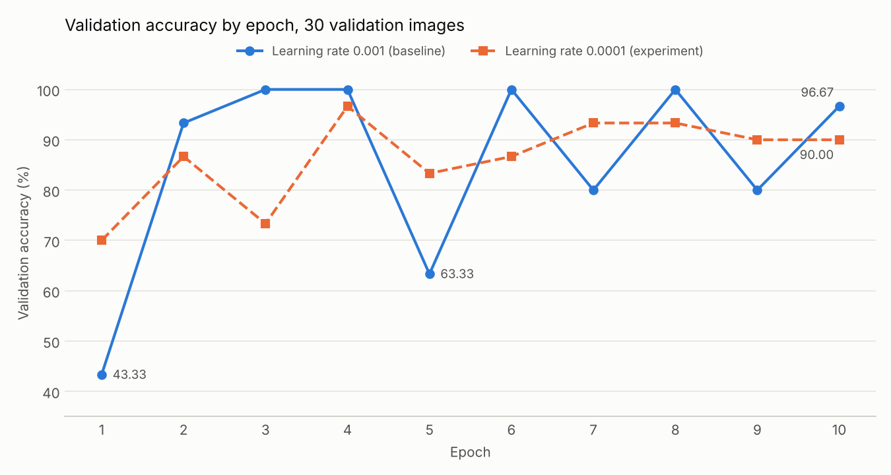
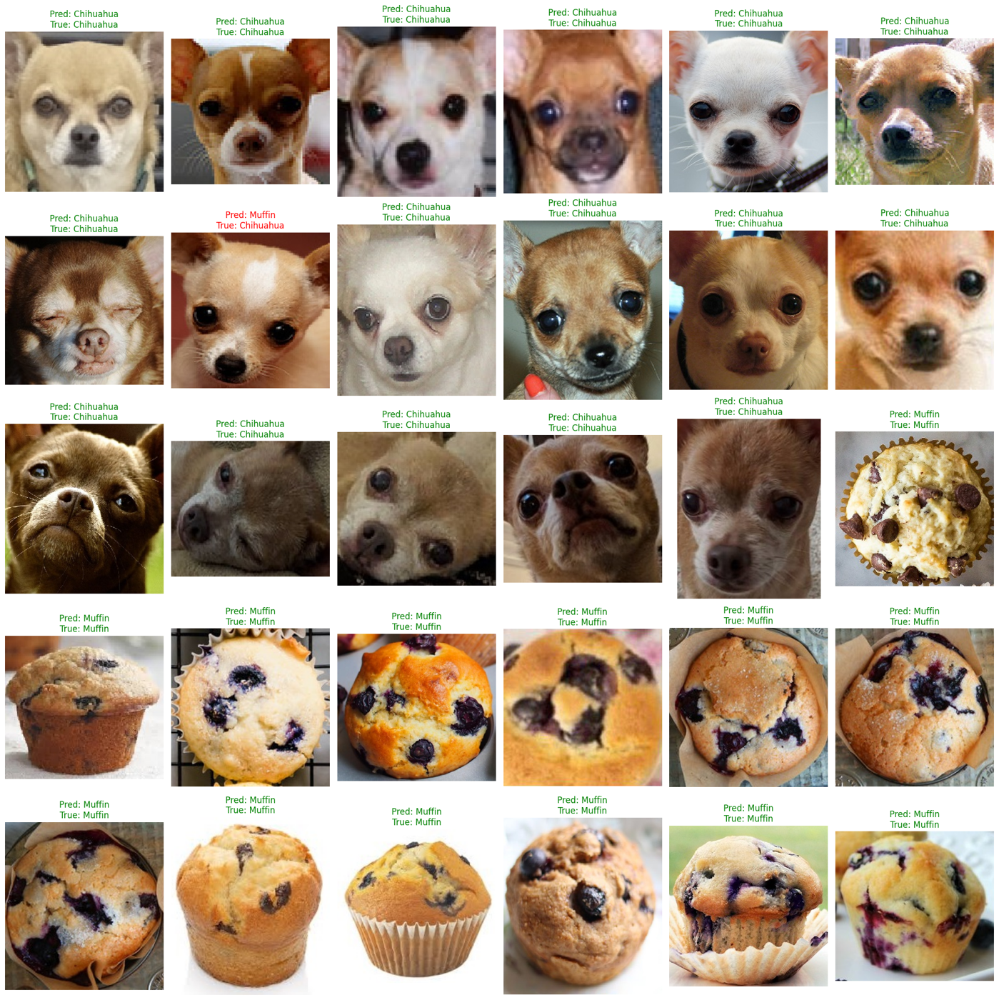

# Chihuahua or Muffin CNN

## Author
Seth Alvarez

## Problem Statement
A Chihuahua and a blueberry muffin can look alike in a photo. This project trains a convolutional neural network (CNN) to tell them apart.

The first training run gives a high accuracy, but the number changes a lot from one epoch to the next. So the second question in this project is how much one accuracy number can be trusted.

This is Lab 05 in Computer Vision (ITAI 1378). The notebook comes from a public workshop, and the experiment at the end is mine.

## Approach
- The notebook is a fill-in workshop notebook. I complete it, run it and add my own experiment at the end.
- The CNN has three blocks of convolution, ReLU and max pooling. After the third block the feature maps are flattened and go to a fully connected classifier with dropout.
- The baseline trains from zero for 10 epochs with the Adam optimizer, a learning rate of 0.001 and a batch size of 32, on a CPU.
- The validation accuracy of the baseline goes up and down a lot. Module 05 of the course lists a jagged curve as a sign that the learning rate is too high, so I test that.
- For the experiment I build a new model and change only one thing: the learning rate goes from 0.001 to 0.0001.

## Dataset

| Source | Size | Classes |
|---|---|---|
| [workshop-chihuahua-vs-muffin](https://github.com/patitimoner/workshop-chihuahua-vs-muffin) (GitHub) | 120 training images and 30 validation images | Chihuahua and muffin |

The training set has 65 Chihuahuas and 55 muffins and the validation set has 17 Chihuahuas and 13 muffins.

The dataset is not in this repository because the first notebook cell downloads the workshop repository that has the images.

## Results

| What I measure | Baseline (learning rate 0.001) | Experiment (learning rate 0.0001) |
|---|---|---|
| Validation accuracy at the last epoch | 96.67% (29 of 30) | 90.00% (27 of 30) |
| Lowest validation accuracy | 43.33% | 70.00% |
| Highest validation accuracy | 100% | 96.67% |
| Difference between lowest and highest | 57 points | 27 points |
| Validation accuracy in epochs 6 to 10 | 80% to 100% | 86.67% to 93.33% |

The model has 51,475,010 parameters. One fully connected layer has 51,380,736 of them and the three convolution layers have only 93,248.

This chart shows the validation accuracy for each epoch in the two runs and uses the numbers that the notebook prints.

The baseline model makes one error on the 30 validation images, where it calls a Chihuahua a muffin.

## Key Findings
- The baseline ends at 96.67% but that is only the result of the last epoch, because epoch 9 gives 80% and epoch 5 gives 63.33%.
- A learning rate ten times lower decreases the difference from 57 points to 27, so it is one cause of the unstable accuracy.
- The validation set has only 30 images so each image is 3.33 points, and six images are the difference between 80% and 100%.
- One fully connected layer has almost all of the parameters and the model trains on only 120 images.
- One number does not say much about this model. The 90% from the experiment is more stable but it comes from a different model than the lab model.

## Technologies Used
- Python and Google Colab
- PyTorch and torchvision
- Matplotlib

## How to Run
1. Open `Chihuahua_Muffin_CNN.ipynb` in Google Colab.
2. Select Runtime and then Run all, and the first cell downloads the workshop repository with the images.
3. A CPU runtime is sufficient and each of the two training runs takes about 4 minutes.

## Credits and AI Use
- Notebook and images: [Workshop: Chihuahua vs. muffin](https://github.com/patitimoner/workshop-chihuahua-vs-muffin) by Andrew Jong, Jing Zhao and Jason Do, from a tutorial by deepsense.ai. Professor Patricia McManus made the CNN notebook for this lab from that workshop.
- The learning rate experiment at the end of the notebook is my own work.
- I used Claude to create an accuracy chart from the numbers that the notebook prints.
