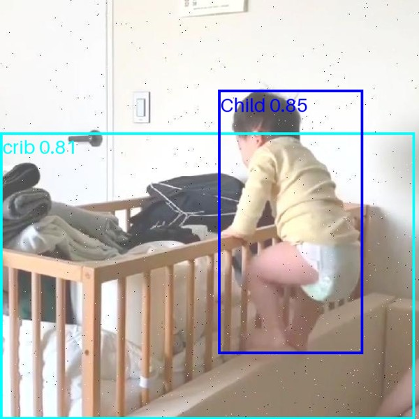

# Crib Sentry

## Author
Seth Alvarez

## Project Tier
Tier 2: three detectors and the logic that changes their boxes into one alert.

## Problem Statement
A traditional baby monitor only helps if someone watches it. Parents cannot watch all the time and they miss much of what the camera records. The goal is to cut down on what they miss.

## Solution Overview
The system takes one image from a crib camera and runs three detectors. One detector finds the crib, one finds the child and one finds toys and blankets. The system compares the positions of the boxes and gives one of four alerts: all clear, left the crib, not visible or hazard present.

## Technical Approach
- CV technique: Object detection
- Model architecture: CNN
- Model: YOLO11n, three models
- How I use it: Transfer learning from weights pretrained on COCO, 50 epochs for each detector
- Framework: PyTorch through Ultralytics
- Augmentation: Darker and lighter images, blur and rotation during training
- Why: Each alert depends on the position of one box compared to another box and bounding boxes give me that.

## Dataset

| Source | Used for | Size | License |
|---|---|---|---|
| [Baby in Crib](https://universe.roboflow.com/test-1caua/baby-in-crib) | Crib and Child training and my 24 test images | 242 images, split 169/49/24 | CC BY 4.0 |
| [Crib_detection](https://universe.roboflow.com/internship-cqxlp/crib_detection-xgv9n) | Crib training | 1,494 images | CC BY 4.0 |
| [BASE crib only BABY only](https://universe.roboflow.com/first-workspace-9obfx/base-crib-only-baby-only-7ytse) | Child training | 309 original images | CC BY 4.0 |
| [Baby object detection final](https://universe.roboflow.com/vtar/baby-object-detection-final) | Child training and my 10 "left the crib" test images | 3,136 original frames for training | CC BY 4.0 |
| [CribHD](https://github.com/ostadabbas/CribNet) T and B | Hazard training | 1,369 training images | Non-commercial |
| CribHD-C | Held-out test | 120 images with no labels | Non-commercial |

Baby in Crib contains studio photos and my first detector fails on real rooms. I add three datasets to train on more cribs and on real camera frames of children. More details are in [data/README.md](data/README.md).

## Success Metrics

| Metric | Target | Result |
|---|---|---|
| Alert accuracy on the 24 test images | 85% or more | 70.8% (17 of 24) |
| Time for each image on a T4 GPU | Less than 1 second | 0.034 seconds |
| "Left the crib" on 10 images from a different dataset | No target | 7 of 10 |
| Alert accuracy on the 120 CribHD-C images | No target | 41.7% (50 of 120) |

The system does not meet the 85% target. Recall is more important to me than precision because a missed problem is worse than a false alarm. The full tables and the errors are in [results/README.md](results/README.md).

A correct alert: the child climbs out and the system gives "left the crib."

A failure: the child climbs out but the system gives "all clear" because in a side view the child box is still on the crib box.

## Milestone Plan

| Phase | Goal | Milestone | Week |
|---|---|---|---|
| Blueprint | Plan approved | Midterm submitted | 6 |
| First Working Demo | Pretrained model runs start to finish on a few sample images | Something works, even if rough | 7 |
| Make It Yours | Add data, training, and alert logic | System works on my problem | 7-8 |
| Improve and Measure | Test, fix, and measure against the metrics | Metrics recorded | 8 |
| Package and Present | Demo video, README, final slides | Final submitted | 9 |

## Resources
- Compute: Google Colab free tier with a T4 GPU
- Cost: $0. Each model, dataset and tool that I use is free or open source.

## Risks and Mitigation

| Risk | Plan B | What happens |
|---|---|---|
| The system does not find a child that lies down or is partly below a blanket | The system gives "not visible" when it finds a crib and no child | On CribHD-C the Child detector finds the doll in 104 of 120 images. The Crib detector finds a crib in only 76 and that causes most errors. |
| No dataset has a child out of a crib | Find a small extra dataset on Roboflow Universe | I find 10 test images in Baby object detection final. The first system gets 0 of 10 correct and the new system gets 7. |

## Demo Video
https://drive.google.com/file/d/1M_8wlFlzOgJ_6HV5io6qun-LyD5dzr_a/view?usp=sharing

## AI Usage Log
See [docs/AI_usage_log.md](docs/AI_usage_log.md)

## Current Status
- [x] Repository created
- [x] Proposal submitted
- [x] First working demo
- [x] System works on my data
- [x] Metrics measured
- [x] Final submitted
