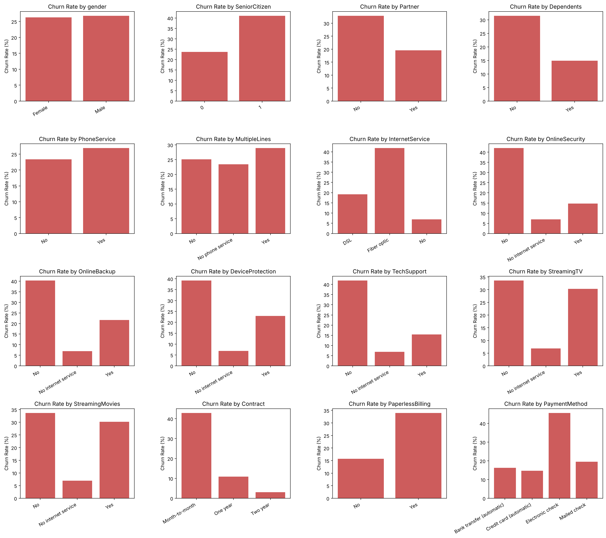
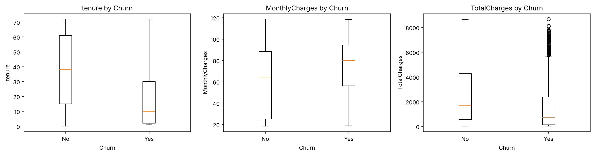

# Telco Customer Churn EDA

## Author
Seth Alvarez

## Problem Statement
A telecom company loses money when customers leave. Before a model can predict who leaves, someone has to understand the data. This project is the exploratory data analysis (EDA) for that problem. It finds the data problems and the patterns that decide how to clean and prepare the data.

This is my section of a group midterm in Intro to Machine Learning (ITAI 1371). The later steps of the midterm (cleaning, encoding, scaling and class balancing) belong to my teammates and aren't in this project.

## Approach
- The data is split into 70% training and 30% testing before any analysis, with the same share of churned customers in each set. Diane Lenhoff wrote this split for my group's midterm and I use her settings.
- I do all of the EDA on the training set only, so nothing I learn comes from the test set.
- The notebook has nine steps: structure of the data, summary statistics for the numeric columns, counts for the categorical columns, the churn distribution, histograms, box plots by churn, churn rate for each category, a correlation heatmap, and a check for missing values and duplicates.
- The notebook ends with a summary and a plan for the next steps.

## Dataset

| Source | Size | Target | License |
|---|---|---|---|
| [Customers churned in telecom services](https://www.kaggle.com/datasets/kapturovalexander/customers-churned-in-telecom-services) (Kaggle) | 7,043 rows and 20 columns | `Churn` (Yes or No) | CC0 Public Domain |

The dataset is not in this repository. Download `customer_churn_telecom_services.csv` from the Kaggle link to run the notebook.

## Results

| What I measure | Result |
|---|---|
| Training set and testing set | 4,930 rows and 2,113 rows |
| Churn in the training set | 73.5% stayed and 26.5% left |
| Missing values | 7, all in TotalCharges and all with a tenure of 0 |
| Duplicate rows | 9 |
| Skewness of TotalCharges | 0.95 |
| Correlation of tenure and TotalCharges | 0.83 |
| Median tenure | 10 months for customers who left and 38 for customers who stayed |
| Median MonthlyCharges | 80 for customers who left and 64 for customers who stayed |
| Churn rate by contract | 42.9% month-to-month, 10.9% one year, 3.0% two year |

Churn rate for each category in the 16 categorical columns:

Numeric columns for customers who stayed and customers who left:

All five charts are in the [results](results) folder.

## Key Findings
- Customers leave the most when they are on month-to-month contracts (42.9%), pay by electronic check (45.6%) or have fiber optic (41.8%).
- Customers who left stayed a shorter time and paid more each month.
- All 7 missing TotalCharges values belong to customers with a tenure of 0. They have no bill yet, so the right value is 0 and not the median.
- A model that always guesses No is right 73.5% of the time, so accuracy alone isn't enough to tell if a model is good.
- Men and women leave at about the same rate.

## Technologies Used
- Python and Google Colab
- pandas and Matplotlib
- scikit-learn, for the train and test split

## How to Run
1. Open `Telco_Churn_EDA.ipynb` in Google Colab.
2. Download `customer_churn_telecom_services.csv` from the Kaggle link in the Dataset section.
3. Upload the CSV file to the Colab session storage.
4. Select Runtime, then Run all. The notebook saves the charts to a `results` folder.

## Credits and AI Use
- Dataset: Customers churned in telecom services by kapturovalexander on Kaggle, CC0 Public Domain.
- Diane Lenhoff wrote the 70/30 split in my group's midterm notebook, and this project uses her settings.
- I used Claude (Anthropic) to help organize the notebook and verify my code works on certain steps in the process.
