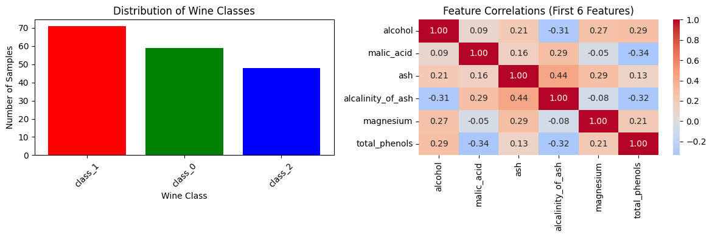
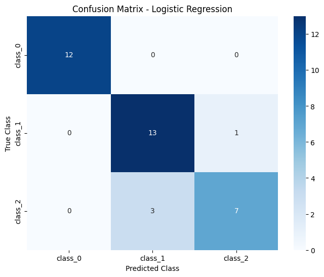

# Wine Classification

## Author
Seth Alvarez

## Problem Statement
The Wine dataset has the chemical analysis of 178 wines from three types of grape plant grown in Italy. This project trains a model to predict the wine class from the chemical features and compares two models on the same data.

This is Lab 03 in Intro to Machine Learning (ITAI 1371). The lab goes through the full machine learning workflow from loading the data to evaluating the model.

## Approach
- The data has 178 samples, 13 features, 3 classes and no missing values.
- I look at the class distribution and the correlation between the first six features before training.
- The baseline uses four features: alcohol, malic_acid, ash and alcalinity_of_ash.
- The data is split into 80% training and 20% testing with the same share of each class in both sets, which gives 142 training samples and 36 testing samples.
- I train Logistic Regression and a Decision Tree with a maximum depth of 3 on the same training set.
- For my own model I choose three different features (magnesium, flavanoids and alcohol) and train Logistic Regression on the same split.

## Dataset

| Source | Size | Target |
|---|---|---|
| [Wine dataset](https://scikit-learn.org/stable/datasets/toy_dataset.html#wine-recognition-dataset) (scikit-learn) | 178 samples and 13 features | `wine_class` (class_0, class_1 or class_2) |

The dataset is not in this repository because the notebook loads it from scikit-learn with `load_wine()`.

## Results

| Model | Features | Test accuracy |
|---|---|---|
| Logistic Regression | 4 baseline features | 88.9% (32 of 36) |
| Decision Tree, maximum depth 3 | 4 baseline features | 83.3% (30 of 36) |
| Logistic Regression | magnesium, flavanoids and alcohol | 94.4% (34 of 36) |

The baseline Logistic Regression gets every class_0 wine correct and has its lowest recall on class_2 at 0.70.

Class distribution and the correlation between the first six features:

Confusion matrix of the baseline Logistic Regression on the 36 test wines:

## Key Findings
- My three features give 94.4% and the four baseline features give 88.9%, so the choice of features matters more than the choice of model in this lab.
- Logistic Regression does better than the Decision Tree because it uses all four features together. It multiplies each feature value by a learned weight, adds them into a total for each class and picks the class with the highest total.
- The Decision Tree stops at three splits and asks about one feature at a time, so a wine on the wrong side of the first split stays wrong.
- A deeper tree could fit these 36 test wines better but that leans toward memorization. A model has to work on data it has not seen and not only on the data it trained on.
- The next step would be to try a range of max_depth values with cross-validation and not tune against the test set.

## Technologies Used
- Python and Google Colab
- pandas and NumPy
- scikit-learn
- Matplotlib and seaborn

## How to Run
1. Open `Wine_Classification.ipynb` in Google Colab.
2. Select Runtime and then Run all. The notebook loads the dataset from scikit-learn, so there is no file to download.

## Credits
- Dataset: Wine recognition dataset, loaded from scikit-learn.
- The notebook is the Module 3 lab exercise from the course. The feature selection in Part 7, the answers in Part 8 and the reflection are my own work.
